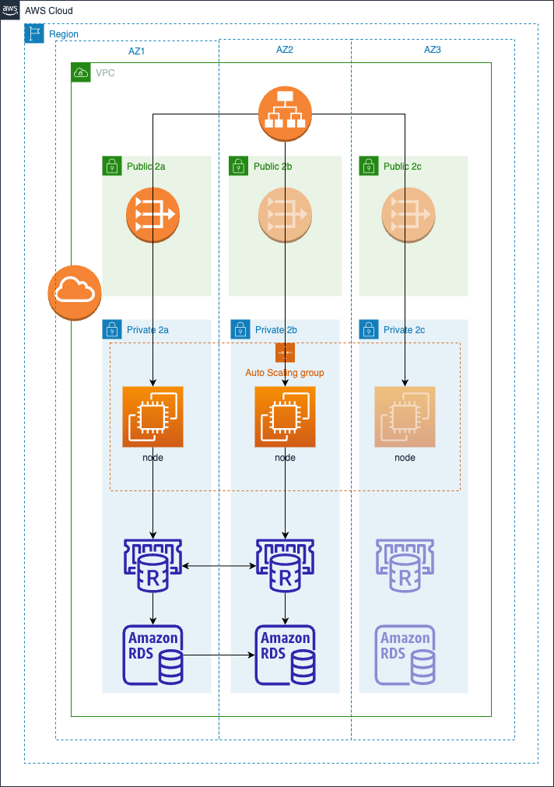

# Amazon EKS Cluster 

## Prerequisites:

Ensure that you have the following tools installed locally:

1. [aws cli](https://docs.aws.amazon.com/cli/latest/userguide/install-cliv2.html)
2. [kubectl](https://Kubernetes.io/docs/tasks/tools/)
3. [terraform](https://learn.hashicorp.com/tutorials/terraform/install-cli)

## Deploy

To provision this example:

```sh
terraform init
terraform apply
```

Enter `yes` at command prompt to apply

## Validate

The following command will update the `kubeconfig` on your local machine and allow you to interact with your EKS Cluster using `kubectl` to validate the deployment.

1. Run `update-kubeconfig` command:

```sh
aws eks --region <REGION> update-kubeconfig --name <CLUSTER_NAME>
```

2. List the nodes running currently

```sh
kubectl get nodes
```

```
# Output should look like below
NAME                          STATUS   ROLES    AGE   VERSION
ip-10-0-22-173.ec2.internal   Ready    <none>   48m   v1.27.3-eks-a5565ad
```


## Destroy

To teardown and remove the resources created in this example:

```sh
terraform destroy -target="module.eks_blueprints_addons" -auto-approve
terraform destroy -auto-approve
```


## Prodaction application schema
I have designed a production environment schema with certain limitations. It consists of one region and is divided into three availability zones to enhance reliability and fault tolerance. However, it's essential to consider the specific requirements of each customer. If needed, we can extend this setup to include additional regions for increased redundancy and better load balancing using Route 53

